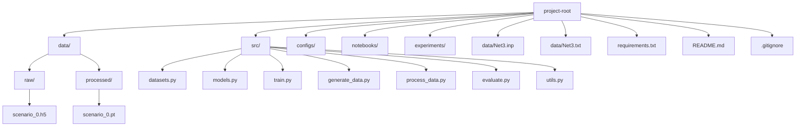

# Project Architecture Plan

This document describes the proposed architecture for your GNN-based leak localization project, synthesizing all decisions and requirements from your design, data, and training documents.

---

## 1. Directory Structure

```
project-root/
│
├── data/
│   ├── raw/                # Raw simulation outputs (HDF5 files, one per scenario)
│   └── processed/          # Processed PyG Data objects (.pt files, one per scenario)
│
├── src/                    # Source code for the project
│   ├── datasets.py         # Custom PyG Dataset class (WDNLeakDataset)
│   ├── models.py           # GNN model architecture(s)
│   ├── train.py            # Training script (data split, training loop, evaluation)
│   ├── generate_data.py    # Script to run WNTR simulations and create raw HDF5 files
│   ├── process_data.py     # Script to process raw HDF5 into PyG .pt files (optional)
│   ├── evaluate.py         # Script for evaluation/metrics/visualization (optional)
│   └── utils.py            # Utility functions (normalization, logging, etc.)
│
├── configs/                # Configuration files (YAML/JSON for hyperparameters, paths, etc.)
│
├── notebooks/              # Jupyter notebooks for exploration, visualization, error analysis
│
├── experiments/            # Logs, checkpoints, and experiment tracking (TensorBoard, WandB, etc.)
│
├── data/Net3.inp           # EPANET input file for Net3 (network definition)
├── data/Net3.txt           # (Optional) Text version of Net3 network
│
├── requirements.txt        # Python dependencies
├── README.md               # Project overview and instructions
└── .gitignore              # Ignore data, logs, checkpoints, etc.
```

---

## 2. Mermaid Diagram



---

## 3. Justification of Structure

### **data/raw/** and **data/processed/**
- **Justification:** As per your data_saving.md, raw simulation outputs (HDF5) and processed PyG Data objects (.pt) must be clearly separated for reproducibility, modularity, and efficient loading.

### **src/**
- **datasets.py:** Implements `WDNLeakDataset` (see data_saving.md, section 5).
- **models.py:** Contains the GNN architecture (GINEConv/NNConv, MLP, etc. per Architecture_modele.md).
- **train.py:** Handles data splits, training, validation, and metrics (see training_and_metrics.md).
- **generate_data.py:** Runs WNTR/EPANET simulations to produce raw data (see Hypotheses_de_donnes.md and data_saving.md).
- **process_data.py:** (Optional) For explicit data processing if not handled in Dataset.process().
- **evaluate.py:** For advanced evaluation, error analysis, and visualization (see training_and_metrics.md).
- **utils.py:** Shared utilities (normalization, logging, etc.).

### **configs/**
- **Justification:** Centralizes experiment configuration (hyperparameters, paths, etc.) for reproducibility and easy experiment management.

### **notebooks/**
- **Justification:** For exploratory data analysis, visualization, and error analysis (see training_and_metrics.md, section 2.3).

### **experiments/**
- **Justification:** Stores logs, checkpoints, and experiment tracking outputs (TensorBoard, WandB, etc.).

### **data/Net3.inp** and **data/Net3.txt**
- **Justification:** Network definition files required for simulation and graph construction.

### **requirements.txt, README.md, .gitignore**
- **Justification:** Standard for Python projects to manage dependencies, provide documentation, and ignore large/intermediate files.

---

## 4. Summary Table

| Directory/File         | Purpose                                                                 |
|-----------------------|-------------------------------------------------------------------------|
| data/raw/             | Raw simulation outputs (HDF5)                                           |
| data/processed/       | Processed PyG Data objects (.pt)                                        |
| src/                  | All source code (datasets, models, training, data generation, utils)    |
| configs/              | Experiment and hyperparameter configs                                   |
| notebooks/            | Jupyter notebooks for analysis/EDA                                      |
| experiments/          | Logs, checkpoints, experiment tracking                                  |
| data/Net3.inp/.txt    | Network definition files                                                |
| requirements.txt      | Python dependencies                                                     |
| README.md             | Project overview and instructions                                       |
| .gitignore            | Ignore data, logs, checkpoints, etc.                                    |

---

## 5. References

- All decisions and structure are based on your documents:
  - Architecture_modele.md
  - Hypotheses_de_donnes.md
  - training_and_metrics.md
  - data_saving.md