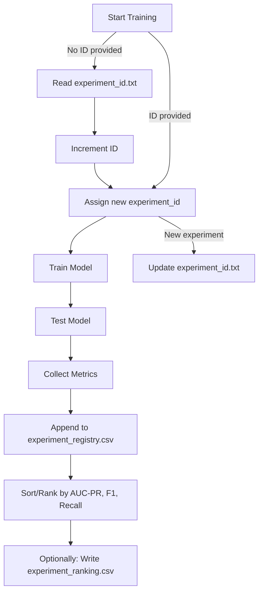

# Experiment Management and Result Ranking Plan

This document details the system for robust experiment management, automatic experiment ID assignment, and result ranking for GNN-based leak localization experiments.

---

## 1. Experiment ID Management

**Goal:**  
Ensure each experiment (unique model/config) gets a unique, persistent, auto-incremented ID, which is reused for test after train, and only incremented for new experiments.

**Design:**
- **experiment_id.txt**: Store the last used experiment ID in `experiments/experiment_id.txt`.
- **ID Assignment Logic:**
  - When starting a new training run, if no ID is provided, read the last ID, increment, and assign it.
  - If resuming/testing an existing experiment, use the existing ID.
  - Update `experiment_id.txt` only when a new experiment is created (not for test runs).

---

## 2. Experiment Registry (CSV)

**Goal:**  
Track all experiment runs, their parameters, and results, and keep a full history.

**Design:**
- **File:** `experiments/experiment_registry.csv`
- **Columns:**
  - `experiment_id`
  - `date`
  - `model_type`
  - `node_in_dim`
  - `edge_in_dim`
  - `hidden_dim`
  - `num_layers`
  - `gnn_type`
  - `mlp_hidden_dim`
  - `dropout`
  - `norm_type`
  - `hyperparameters` (other, as JSON or key-value)
  - `notes`
  - `AUC-PR`
  - `F1`
  - `recall`
- **Update Logic:**
  - At the end of every test run, append a new row with all relevant info and metrics.
  - Never overwrite previous runs (full history).

---

## 3. Automatic Result Ranking

**Goal:**  
Automatically rank experiments by AUC-PR, F1, and recall.

**Design:**
- After each test run, sort the registry (in memory or for display) by AUC-PR, then F1, then recall.
- Optionally, generate a `experiments/experiment_ranking.csv` with the sorted results for easy review.

---

## 4. Integration Points

**Where to implement:**
- **ID assignment:** At the start of training (in `train.py` or a utility module).
- **Registry update:** At the end of test/evaluation (in `evaluate.py`).
- **Ranking:** As a utility function, or as part of the registry update.

---

## 5. Example: experiment_registry.csv

| experiment_id | date                | model_type | node_in_dim | edge_in_dim | hidden_dim | num_layers | gnn_type | mlp_hidden_dim | dropout | norm_type | hyperparameters | notes         | AUC-PR | F1   | recall |
|---------------|---------------------|------------|-------------|-------------|------------|------------|----------|---------------|---------|-----------|-----------------|---------------|--------|------|--------|
| 1             | 2025-04-14 13:30:00 | GNN        | 8           | 4           | 128        | 3          | gine     | 128           | 0.3     | layer     | {"lr":0.001}    | baseline run  | 0.82   | 0.76 | 0.80   |
| 2             | 2025-04-15 09:10:00 | GNN        | 8           | 4           | 256        | 4          | nnconv   | 128           | 0.2     | batch     | {"lr":0.0005}   | more layers   | 0.85   | 0.78 | 0.83   |

---

## 6. System Overview (Mermaid Diagram)

---

## 7. Implementation Steps

1. **Create experiment_id.txt** in `experiments/` if not present.
2. **Add utility functions** for:
   - Reading/incrementing experiment ID.
   - Appending to the registry CSV.
   - Sorting and exporting rankings.
3. **Modify train.py** to use the ID system.
4. **Modify evaluate.py** to update the registry and trigger ranking.
5. **(Optional):** Add CLI or script to display top experiments.

---

## 8. Tips

- Keep data, code, and experiments organized as per the architecture.
- Regularly backup important results and configurations.

---

This plan ensures robust experiment tracking, reproducibility, and easy identification of the best models.