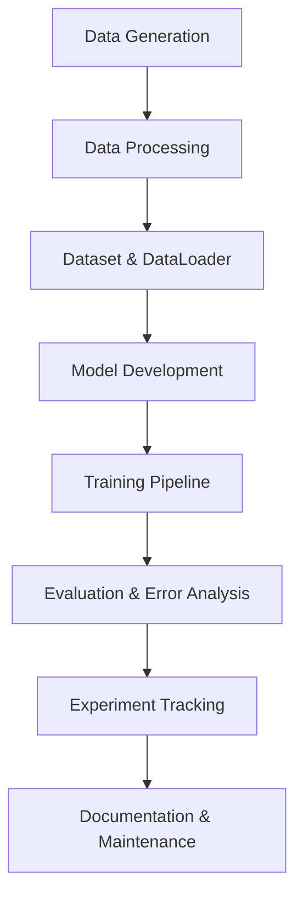

# Project Roadmap: GNN-based Leak Localization in Water Distribution Networks

This roadmap provides a step-by-step guide to develop, train, and evaluate a Graph Neural Network (GNN) for leak localization in water distribution networks, following the architecture and data strategy defined in the project documentation.

---

## 1. Data Generation

**Goal:** Simulate hydraulic scenarios (with and without leaks) using WNTR/EPANET and store results in HDF5 format.

- **Script:** `src/generate_data.py`
- **Input:** `data/Net3.inp` (network definition)
- **Output:** HDF5 files in `data/raw/` (one per scenario)
 

---

## 2. Data Processing

**Goal:** Convert raw simulation outputs into PyTorch Geometric (PyG) Data objects for GNN training.

- **Script:** `src/process_data.py` (or `Dataset.process()` in `src/datasets.py`)
- **Input:** HDF5 files in `data/raw/`
- **Output:** `.pt` files in `data/processed/` (one per scenario)
- **Key Actions:**
  - Compute node and edge features (pressure differences, static attributes)
  - Normalize/standardize features
  - Encode labels (leak location)
  - Save as PyG Data objects

---

## 3. Dataset and DataLoader Setup

**Goal:** Implement a custom PyG Dataset for efficient loading and splitting of data.

- **Script:** `src/datasets.py`
- **Key Actions:**
  - Implement `WDNLeakDataset` class
  - Support programmatic train/val/test splits
  - Use `torch_geometric.loader.DataLoader` for batching

---

## 4. Model Development

**Goal:** Implement the GNN architecture for leak localization.

- **Script:** `src/models.py`
- **Key Actions:**
  - Implement GINEConv/NNConv-based GNN layers
  - Integrate edge features
  - Add MLP classifier for edge-level prediction
  - Include normalization, dropout, and activation layers

---

## 5. Training Pipeline

**Goal:** Train the GNN model on the processed data.

- **Script:** `src/train.py`
- **Config:** `configs/` (hyperparameters, paths)
- **Key Actions:**
  - Set up optimizer (AdamW), loss function (Focal Loss)
  - Implement early stopping, learning rate scheduling
  - Log metrics (AUC-PR, Recall, MRR, Hits@k) using TensorBoard or WandB
  - Save best model checkpoints in `experiments/`

---

## 6. Evaluation and Error Analysis

**Goal:** Evaluate model performance and analyze errors.

- **Script:** `src/evaluate.py`
- **Key Actions:**
  - Compute evaluation metrics on test set
  - Visualize predictions and error cases
  - Compare with baseline methods
  - Use notebooks in `notebooks/` for in-depth analysis

---

## 7. Experiment Tracking and Reproducibility

**Goal:** Ensure experiments are reproducible and results are tracked.

- **Artifacts:** `experiments/` (logs, checkpoints), `configs/` 
- **Key Actions:**
  - Save all experiment configurations
  - Track results and model versions
  - Use `.gitignore` to exclude large data and logs from version control

---

## 8. Documentation and Maintenance

**Goal:** Maintain clear documentation and keep the project organized.

- **Artifacts:** `README.md`, `PROJECT_ARCHITECTURE.md`, `PROJECT_ROADMAP.md`
- **Key Actions:**
  - Update documentation as the project evolves
  - Keep code modular and well-commented
  - Regularly review and refactor as needed

---

## Visual Overview

---

## Milestones

1. **Data simulation pipeline operational** (`data/raw/` populated)
2. **Processed PyG dataset ready** (`data/processed/` populated)
3. **Custom Dataset and DataLoader implemented**
4. **GNN model implemented and tested**
5. **Training pipeline with logging and early stopping**
6. **Evaluation scripts and error analysis notebooks**
7. **Experiment tracking and reproducibility ensured**
8. **Comprehensive documentation available**

---

## Tips

- Keep data, code, and experiments organized as per the architecture.
- Regularly backup important results and configurations.

---

This roadmap should guide you through the full lifecycle of the project, from data generation to model evaluation and documentation.